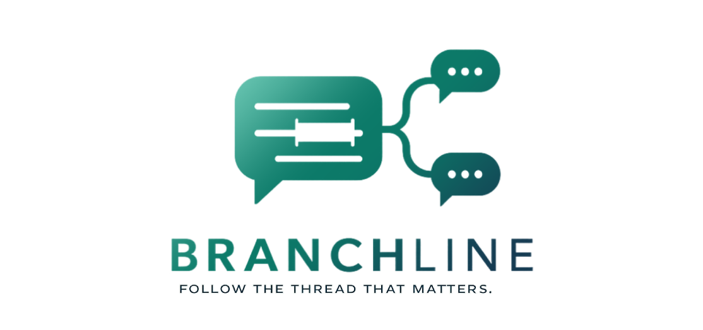

A lightweight browser app for chatting with LLM models in a clean, branching interface.

- Video: [link](https://youtu.be/up_wG7gcTvY)  
- Demo: [link](https://grigtod.github.io/branchline/)
- Photos: [link](https://drive.google.com/drive/folders/1rQ_os_vhJbZnVsV1hQ5KLNNrPEiXMqyE)  

## What it does

- Lets you paste an OpenAI API key into a password-style field
- Lets you pick a model and thinking level before chatting
- Saves conversations in a left sidebar
- Lets you highlight any assistant response text and open a menu with advanced features: Compact, Branch, Debate, Analyse, Favourite

## Run it

This project is static HTML, CSS, and JavaScript. You can:

1. Open `index.html` directly in a browser, or
2. Serve the folder locally with a simple static server such as:

```powershell
python -m http.server 8000
```

Then open `http://localhost:8000`.
